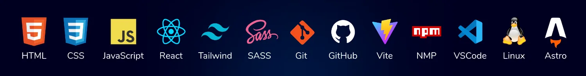

<h1 align= 'center'>🙋Hola, Soy Josue Tapia 🧑‍💻</h1> 
 

&nbsp;&nbsp;
 
&nbsp;&nbsp;

Desarrollador Front-End especializado en JavaScript, con más de 4 años de experiencia y más de 100 certificaciones de Platzi, abarcando desde fundamentos hasta temas avanzados en desarrollo web.
Comprometido con el aprendizaje continuo.

Mi objetivo es dominar React, TypeScript y Next.js, así como adquirir sólidos conocimientos de desarrollo backend.

Si buscas un desarrollador web dedicado y apasionado, estoy listo para formar parte de tu equipo.

## 💻 Tecnologías y Herramientas

## 📊 Estadísticas de GitHub:

&nbsp;&nbsp;&nbsp;&nbsp;

## 💚 Perfil de Platzi:

 

