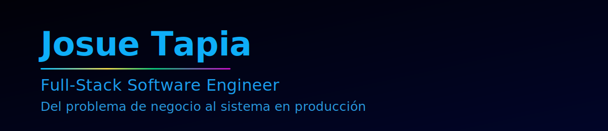

<picture>
  <source media="(prefers-color-scheme: dark)" srcset="assets/banner.svg">
  <source media="(prefers-color-scheme: light)" srcset="assets/banner.svg">
  
</picture>

---

### 🔗 Contacto

  
  
  

---

<h3 style="margin-bottom: 5px; padding-bottom: 0px;font-size: 22px">
  Full-Stack Software Engineer
</h3>

  Convierto problemas complejos en sistemas simples, seguros y escalables mediante arquitectura de software moderna con (TypeScript, Next.js y Supabase) Integro flujos de desarrollo asistidos por IA (Claude Code, DeepSeek) para multiplicar la velocidad de entrega manteniendo altos estándares de ingeniería y seguridad.

---

### 🛠️ Stack técnico

**💻 Lenguajes**

---

**🎨 Frontend**

---

**⚙️ Backend y datos**

---

**🧩 Arquitectura y herramientas**

---

### 📊 Actividad

  <picture>
    <source media="(prefers-color-scheme: dark)" srcset="https://github-readme-streak-stats.herokuapp.com/?user=josttme&theme=algolia&hide_border=false">
   
  </picture>

